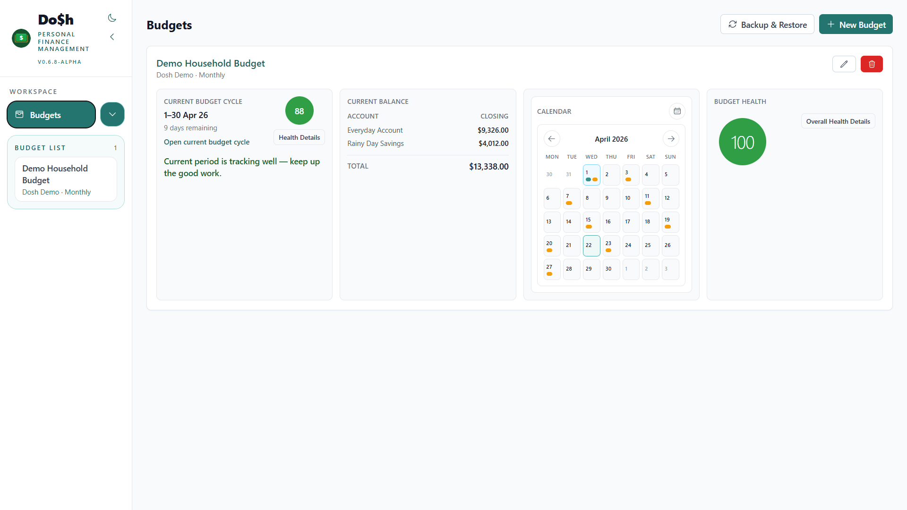
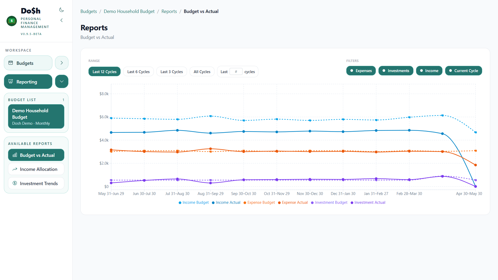

# Dosh

<div style="font-family: -apple-system, BlinkMacSystemFont, 'Segoe UI', Helvetica, Arial, sans-serif; color: #8b949e; line-height: 1.5; margin-bottom: 25px; padding-left: 2px;">
  <div style="margin-bottom: 2px;">
    <span style="color: #c9d1d9; font-weight: 600; font-size: 0.95em;">dosh</span> 
    <span style="font-size: 0.85em; margin-left: 4px;">/ˈdɒʃ/</span>
    <i style="color: #77828d;">noun</i> 
    <span style="margin: 0 4px; color: #484f58;">•</span> 
    <span>rhymes with posh</span>
    <span style="margin: 0 4px; color: #484f58;">•</span> 
    <span>informal, British & Australian</span>
  </div>

  <div style="font-size: 0.9em; max-width: 700px;">
    Slang for money, typically physical cash. 
    <span style="color: #6e7681; font-style: italic; margin-left: 4px;">
      "It's a cracking ute, mate, but it'll cost you a serious bit of <b>dosh</b>."
    </span>
  </div>
</div>

<br>

[](https://github.com/mixednutts/dosh/releases)
[](https://github.com/mixednutts/dosh/pkgs/container/dosh)
[](LICENSE)

## What is Dosh?
**Dosh** is a workflow-driven personal finance application designed for people who want intentional control over their money without the complexity of traditional accounting software.

Dosh helps you manage your finances through a structured budget cycle approach:

- **Guided Budget Setup** — Define income sources, expense categories, savings goals, and investment plans
- **Budget Cycle Planning** — Create and manage budget cycles with clear start/end dates
- **Transaction-Backed Tracking** — Record actual income, expenses, and transfers with full ledger transparency
- **Close-Out Workflows** — Complete budget cycles with carry-forward surplus handling and historical snapshots
- **Budget Health Insights** — Get supportive, explainable assessments of your budget's setup and execution health
- **Regional Formatting** — Automatic locale-aware date, currency, and number formatting

## Preview

### Dashboard
(Summary Page Light | Dark ; Cycles Page Light | Dark ; Details Page Light | Dark)



### Reports
(Budget vs Actual, Income Allocation, Investment Trends)



## Quick Start

### Prerequisites

- [Docker](https://docs.docker.com/get-docker/)
- [Docker Compose](https://docs.docker.com/compose/install/)

### Deployment

1. Create a `docker-compose.yml` file:

```yaml
services:
  dosh:
    image: ghcr.io/mixednutts/dosh:latest
    container_name: dosh
    restart: unless-stopped
    volumes:
      - dosh-data:/app/data
    environment:
      - DATABASE_URL=sqlite:////app/data/dosh.db
      - TZ=Australia/Sydney
    ports:
      - "3080:3080"

volumes:
  dosh-data:
```

2. Start the application:

```bash
docker compose up -d
```

3. Access Dosh at `http://localhost:3080`

4. Create your first budget or load a demonstration budget to evaluate the features

## Tech Stack

- **Backend:** Python 3.12, FastAPI, SQLAlchemy, SQLite
- **Frontend:** React 18, Vite, React Query, React Router
- **Testing:** pytest, Jest, React Testing Library, Playwright
- **Deployment:** Docker, Docker Compose, GitHub Container Registry

## License

[MIT License](LICENSE)

## Support

For issues, feature requests, or contributions, please visit the [GitHub repository](https://github.com/mixednutts/dosh).

---

**Note:** Dosh is currently in beta and may contain bugs.  Use at your own risk.
