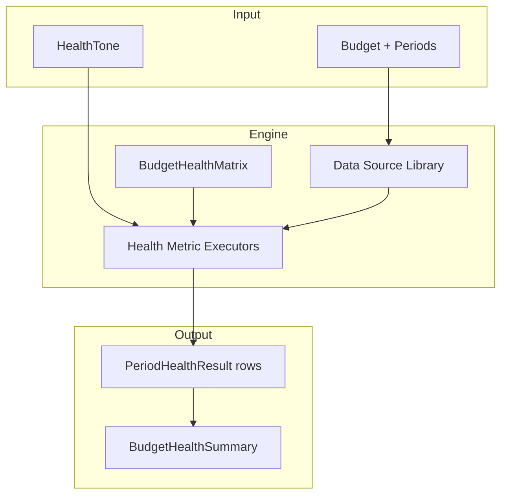

# Budget Health Engine Plan

This plan defines the transition from the current fixed health-scoring implementation to a configurable, versioned, and extensible **Budget Health Engine**.

## Purpose

The Budget Health Engine is a metrics-driven system that:
- Computes budget health through independently versioned, reusable metrics
- Separates metric definitions (stored in DB) from execution logic (code-backed)
- Supports per-budget, per-metric threshold configuration and weighting through a dedicated framework
- Allows users to build custom metrics from pre-built data sources and simple formulas
- Maintains point-in-time health snapshots for closed periods
- Provides drill-down from health results to underlying transactions and line items

Read this alongside:
- [BUDGET_HEALTH_ADDENDUM.md](./BUDGET_HEALTH_ADDENDUM.md) — staged health design direction
- [CHANGES.md](../CHANGES.md) — implementation history and constraints
- [TEST_STRATEGY.md](../tests/TEST_STRATEGY.md) — testing posture for health features

---

## Current State Assessment

The existing implementation in [`budget_health.py`](../../backend/app/budget_health.py) provides:

| Component | Description | Limitation |
|-----------|-------------|------------|
| `setup_health` | Evaluates income sources, active expenses, future period coverage | Fixed logic, not reusable |
| `budget_discipline` | Measures historical outflow overrun across closed periods | Hard-coded lookback window |
| `planning_stability` | Tracks off-plan activity in current periods | Tied to specific transaction patterns |
| `current_period_check` | Live-period deficit, tolerance, revision pressure, timing factor | Monolithic, not composable |

**Thresholds:** Six sliders stored directly on the [`Budget`](../../backend/app/models.py) table as columns.

**Snapshots:** [`PeriodCloseoutSnapshot`](../../backend/app/models.py) stores a full JSON blob `health_snapshot_json`, making historical querying and metric evolution tracking difficult.

**Frontend:** [`BudgetsPage.jsx`](../../frontend/src/pages/BudgetsPage.jsx) displays a compact score circle and details modal. [`PersonalisationTab.jsx`](../../frontend/src/pages/tabs/PersonalisationTab.jsx) provides slider controls.

---

## Proposed Architecture

### Core Concepts

| Concept | Definition |
|---------|------------|
| **Data Source** | System-level reusable query that extracts raw budget/period data (e.g. `total_expenses`, `budgeted_income`) |
| **Scale** | System-level reusable scale definition (e.g. `1-100`, `High/Medium/Low`, `Percentage`, `Dollar Value`) |
| **Metric Template** | Pre-built metric blueprint with formula, data sources, and default scale/value |
| **Health Metric** | A user-created or system metric instance combining data sources, formula, scale, default value, scoring logic, evidence rules, and drill-down config |
| **Matrix Template** | Reusable template defining a default set of metrics and weights (e.g. "Standard Budget Health") |
| **Budget Health Matrix** | Per-budget matrix containing the user's chosen metrics, weights, threshold values, sensitivities, and enablement state |
| **Period Health Result** | Individual computed metric row per period (current live result or snapshotted for closed periods) |
| **Tone Profile** | Global budget preference (`supportive`, `factual`, `friendly`) selecting summary message variants |

### Metric Scope Classification

Each metric declares its applicable scope:

| Scope | Meaning | Example Metrics |
|-------|---------|-----------------|
| `CURRENT_PERIOD` | Evaluated against the active/current period only; shown in current period check | Live Surplus/Deficit, Revision Pressure, Timing Sensitivity |
| `OVERALL` | Evaluated at budget level or across historical periods; rolled into overall score only | Setup Health, Budget Discipline, Momentum, Close-out Habits |
| `BOTH` | Computed per period; contributes to overall and shown for current period if active | Planning Stability |

**Pending closure periods** are treated as editable but their results roll into the overall budget health.

---

## Data Models

### HealthDataSource

System catalog of reusable data extraction queries.

```python
class HealthDataSource(Base):
    __tablename__ = "healthdatasources"
    source_key = Column(String, primary_key=True)
    name = Column(String, nullable=False)
    description = Column(Text)
    version = Column(Integer, nullable=False, default=1)
    executor_path = Column(String, nullable=False)
    return_type = Column(String, nullable=False)         # decimal | integer | count | boolean
    cache_ttl_seconds = Column(Integer, default=0)
```

### HealthDataSourceParameter

Parameters accepted by a data source.

```python
class HealthDataSourceParameter(Base):
    __tablename__ = "healthdatasourceparameters"
    source_key = Column(String, ForeignKey("healthdatasources.source_key"), primary_key=True)
    param_name = Column(String, primary_key=True)
    param_type = Column(String, nullable=False)          # string | integer | decimal | boolean | period_scope
    default_value = Column(Text, nullable=True)
    is_required = Column(Boolean, default=True)
```

### HealthScale

System catalog of reusable scales.

```python
class HealthScale(Base):
    __tablename__ = "healthscales"
    scale_key = Column(String, primary_key=True)
    name = Column(String, nullable=False)
    scale_type = Column(String, nullable=False)          # integer_range | decimal_range | enum | money
    min_value = Column(Numeric, nullable=True)
    max_value = Column(Numeric, nullable=True)
    step_value = Column(Numeric, nullable=True)
    unit_label = Column(String, nullable=True)
```

### HealthScaleOption

Options for enum-type scales.

```python
class HealthScaleOption(Base):
    __tablename__ = "healthscaleoptions"
    scale_key = Column(String, ForeignKey("healthscales.scale_key"), primary_key=True)
    option_value = Column(String, primary_key=True)
    option_label = Column(String, nullable=False)
    option_order = Column(Integer, default=0)
```

### HealthMetricTemplate

Pre-built metric blueprints.

```python
class HealthMetricTemplate(Base):
    __tablename__ = "healthmetrictemplates"
    template_key = Column(String, primary_key=True)
    name = Column(String, nullable=False)
    description = Column(Text)
    scope = Column(String, nullable=False)               # CURRENT_PERIOD | OVERALL | BOTH
    formula_expression = Column(Text, nullable=False)
    formula_data_sources_json = Column(Text, nullable=False)
    scale_key = Column(String, ForeignKey("healthscales.scale_key"), nullable=True)
    default_value_json = Column(Text, nullable=True)
    scoring_logic_json = Column(Text, nullable=False)
    evidence_template_json = Column(Text, nullable=False)
    drill_down_enabled = Column(Boolean, default=False)
    is_system = Column(Boolean, default=False)
```

### HealthMetric

User-created or system metric instances.

```python
class HealthMetric(Base):
    __tablename__ = "healthmetrics"
    metric_id = Column(Integer, primary_key=True, autoincrement=True)
    template_key = Column(String, ForeignKey("healthmetrictemplates.template_key"), nullable=True)
    budgetid = Column(Integer, ForeignKey("budgets.budgetid"), nullable=True)
    name = Column(String, nullable=False)
    description = Column(Text)
    scope = Column(String, nullable=False)
    formula_expression = Column(Text, nullable=False)
    formula_data_sources_json = Column(Text, nullable=False)
    scale_key = Column(String, ForeignKey("healthscales.scale_key"), nullable=True)
    default_value_json = Column(Text, nullable=True)
    scoring_logic_json = Column(Text, nullable=False)
    evidence_template_json = Column(Text, nullable=False)
    drill_down_enabled = Column(Boolean, default=False)
    created_at = Column(UTCDateTime, default=utc_now)
```

### HealthMatrixTemplate

Reusable matrix templates.

```python
class HealthMatrixTemplate(Base):
    __tablename__ = "healthmatrixtemplates"
    template_key = Column(String, primary_key=True)
    name = Column(String, nullable=False)
    description = Column(Text)
    is_system = Column(Boolean, default=False)
```

### HealthMatrixTemplateItem

Default metrics and weights in a matrix template.

```python
class HealthMatrixTemplateItem(Base):
    __tablename__ = "healthmatrixtemplateitems"
    template_key = Column(String, ForeignKey("healthmatrixtemplates.template_key"), primary_key=True)
    metric_template_key = Column(String, ForeignKey("healthmetrictemplates.template_key"), primary_key=True)
    weight = Column(Numeric(5, 4), nullable=False)
    display_order = Column(Integer, default=0)
```

### BudgetHealthMatrix

Per-budget matrix.

```python
class BudgetHealthMatrix(Base):
    __tablename__ = "budgethealthmatrices"
    matrix_id = Column(Integer, primary_key=True, autoincrement=True)
    budgetid = Column(Integer, ForeignKey("budgets.budgetid"), nullable=False, unique=True)
    name = Column(String, nullable=False)
    based_on_template_key = Column(String, ForeignKey("healthmatrixtemplates.template_key"), nullable=True)
    cloned_from_matrix_id = Column(Integer, ForeignKey("budgethealthmatrices.matrix_id"), nullable=True)
    is_active = Column(Boolean, default=True)
    created_at = Column(UTCDateTime, default=utc_now)
```

### BudgetHealthMatrixItem

Metrics, weights, sensitivity, and enablement within a budget's matrix.

```python
class BudgetHealthMatrixItem(Base):
    __tablename__ = "budgethealthmatrixitems"
    matrix_id = Column(Integer, ForeignKey("budgethealthmatrices.matrix_id"), primary_key=True)
    metric_id = Column(Integer, ForeignKey("healthmetrics.metric_id"), primary_key=True)
    weight = Column(Numeric(5, 4), nullable=False)
    scoring_sensitivity = Column(Integer, nullable=False, default=50)
    threshold_value_json = Column(Text, nullable=True)
    display_order = Column(Integer, default=0)
    is_enabled = Column(Boolean, default=True)
```

### PeriodHealthResult

Computed metric results for a specific period.

```python
class PeriodHealthResult(Base):
    __tablename__ = "periodhealthresults"
    id = Column(Integer, primary_key=True, autoincrement=True)
    finperiodid = Column(Integer, ForeignKey("financialperiods.finperiodid"), nullable=False)
    matrix_id = Column(Integer, ForeignKey("budgethealthmatrices.matrix_id"), nullable=False)
    metric_id = Column(Integer, ForeignKey("healthmetrics.metric_id"), nullable=False)
    evaluated_at = Column(UTCDateTime, default=utc_now)
    score = Column(Integer, nullable=False)
    status = Column(String, nullable=False)
    summary = Column(Text, nullable=False)
    evidence_json = Column(Text, nullable=False, default="[]")
    drill_down_json = Column(Text, nullable=True)
    is_snapshot = Column(Boolean, default=False)
```

### BudgetHealthSummary

Denormalised overall score for quick API retrieval.

```python
class BudgetHealthSummary(Base):
    __tablename__ = "budgethealthsummaries"
    budgetid = Column(Integer, ForeignKey("budgets.budgetid"), primary_key=True)
    matrix_id = Column(Integer, ForeignKey("budgethealthmatrices.matrix_id"), nullable=False)
    evaluated_at = Column(UTCDateTime, default=utc_now)
    overall_score = Column(Integer, nullable=False)
    overall_status = Column(String, nullable=False)
    momentum_status = Column(String, nullable=False)
    momentum_delta = Column(Integer, default=0)
    metric_results_json = Column(Text, nullable=False, default="[]")
```

### Budget Tone Preference

A new column on `Budget` controls messaging tone.

```python
health_tone = Column(String, nullable=False, default="supportive")
```

Tone is **presentation-only** and **not versioned**. Historical snapshots store the rendered text at close-out time.

---

## Engine Execution Flow



1. **Matrix Resolution** — Load the budget's `BudgetHealthMatrix` and its enabled `BudgetHealthMatrixItem` rows.
2. **Data Source Resolution** — For each metric, resolve required `HealthDataSource` entries and execute their Python executors (cached per request).
3. **Formula Evaluation** — Evaluate the metric's formula expression against data source results using a safe, bounded expression parser (supports `+`, `-`, `*`, `/`, parentheses, and data source references only).
4. **Metric Execution** — Pass formula result, threshold value (from `BudgetHealthMatrixItem.threshold_value_json` or `HealthMetric.default_value_json`), scoring sensitivity, and tone into the metric's Python executor. Returns `score`, `status`, `summary`, `evidence[]`, and optional `drill_down[]`.
5. **Aggregation** — Compute weighted overall score, momentum from historical periods, and status mappings. Store in `BudgetHealthSummary`.
6. **Persistence** — For closed periods, write `PeriodHealthResult` rows with `is_snapshot=true`. For live/current periods, return computed results without snapshotting.

---

## Three-Knob Design

Each metric in a budget matrix exposes three independent controls:

| Knob | Where Stored | Purpose | Example |
|------|--------------|---------|---------|
| **Threshold** | `BudgetHealthMatrixItem.threshold_value_json` | The threshold/benchmark value (overrides metric default) | "Acceptable Deficit Amount = $50" |
| **Scoring Sensitivity** | `BudgetHealthMatrixItem.scoring_sensitivity` | How steeply the metric penalises breaching the threshold | 75 = lose 15 points per $10 over |
| **Matrix Weight** | `BudgetHealthMatrixItem.weight` | How much this metric contributes to the overall budget health score | 0.25 = 25% of total score |

Metrics also carry a `scale_key` and `default_value_json` so every metric has a known scale and fallback value. Matrices can override the default with a per-item threshold.

---

## Tone and Language Framework

Each `HealthMetricTemplate` (and derived `HealthMetric`) stores multiple summary templates keyed by tone:

```json
{
  "summary_templates": {
    "supportive": "This period looks to be tracking along nicely with the current plan.",
    "factual": "Current period surplus is positive and no budget lines exceed tolerance thresholds.",
    "friendly": "Things are looking good this cycle — no red flags so far!"
  }
}
```

The metric executor selects the appropriate template based on `Budget.health_tone` at evaluation time.

---

## Drill-Down Design

Evidence remains textual, but `drill_down_json` contains structured references:

```json
[
  {
    "type": "transaction",
    "label": "View 3 revised expense transactions",
    "query": { "finperiodid": 42, "line_status": "Revised", "source": "expense" }
  },
  {
    "type": "period_expense",
    "label": "View over-budget line: Groceries",
    "finperiodid": 42,
    "expensedesc": "Groceries"
  }
]
```

The frontend renders these as links into transaction or period detail views.

---

## Transition Plan

### Todo Tracking Discipline

Every implementation session must begin with `update_todo_list` and end with confirmation that all todos for that phase are complete. No phase may begin until the previous phase's todos are marked done. This ensures task visibility is never lost across sessions.

### Phase A: Foundation

**Starting Todo List:**
```
[ ] Create Alembic migration for all engine tables
[ ] Seed HealthDataSource catalog
[ ] Seed HealthScale catalog
[ ] Create HealthMetricTemplate rows for 4 existing components (with scale_key and default_value_json)
[ ] Create HealthMatrixTemplate "Standard Budget Health"
[ ] Migrate existing budgets to BudgetHealthMatrix instances
[ ] Add health_tone column to Budget table
[ ] Verify migration in local Docker container
[ ] Run backend tests to confirm no regressions
```

**Steps:**
1. Create all engine tables via Alembic migration.
2. Seed `HealthDataSource` catalog with raw queries already used by the current system.
3. Seed `HealthScale` catalog with initial scales:
   - `percentage_0_100`
   - `ten_scale_1_10`
   - `dollar_amount`
   - `severity_low_med_high`
4. Create `HealthMetricTemplate` rows for the 4 existing components with formulas referencing data sources, each carrying its `scale_key` and `default_value_json`.
5. Create `HealthMatrixTemplate` "Standard Budget Health" containing the 4 metrics with current weights.
6. For each existing budget:
   - Create a `BudgetHealthMatrix` based on "Standard Budget Health"
   - Create `HealthMetric` instances from the templates
   - Create `BudgetHealthMatrixItem` rows with current weights, `scoring_sensitivity=50`, and `threshold_value_json` seeded from the metric template defaults
7. Add `health_tone` column to `Budget`.

**Phase Completion Criteria:** All Phase A todos marked complete via `update_todo_list`.

### Phase B: Engine Execution Layer

**Starting Todo List:**
```
[ ] Build engine/runner.py with safe formula evaluation
[ ] Implement code-backed data source executors
[ ] Implement code-backed metric executors for 4 templates
[ ] Add /api/budgets/{id}/health-engine endpoint
[ ] Build PeriodHealthResult persistence for close-out
[ ] Verify engine output matches legacy endpoint in Docker
[ ] Run full backend test suite
```

**Steps:**
1. Build `engine/runner.py` with safe formula evaluation.
2. Implement code-backed data source executors.
3. Implement code-backed metric executors for the 4 templates.
4. Add `/api/budgets/{id}/health-engine` endpoint running in parallel with existing `/health`.
5. Build `PeriodHealthResult` persistence:
   - On close-out: write snapshot rows with `is_snapshot=true`
   - On-demand/live: compute and return without persisting

**Phase Completion Criteria:** All Phase B todos marked complete via `update_todo_list`.

### Phase C: Frontend Migration

**Starting Todo List:**
```
[ ] Update BudgetsPage.jsx to consume new engine endpoint
[ ] Expand PersonalisationTab.jsx for matrix item management
[ ] Add tone selector to PersonalisationTab
[ ] Add metric builder UI
[ ] Render drill-down links in health modals
[ ] Deprecate legacy /api/budgets/{id}/health endpoint
[ ] Run full frontend test suite
[ ] Verify in local Docker container
```

**Steps:**
1. Update `BudgetsPage.jsx` to consume the new engine endpoint.
2. Expand `PersonalisationTab.jsx` to support:
   - Managing matrix items (enable/disable, adjust weight, adjust sensitivity)
   - Setting per-metric threshold values directly on matrix items
   - Selecting tone preference
3. Add metric builder UI for creating custom metrics from templates.
4. Render drill-down links in health modals.
5. Deprecate and remove the legacy `/api/budgets/{id}/health` endpoint.

**Phase Completion Criteria:** All Phase C todos marked complete via `update_todo_list`.

### Phase D: Cleanup

**Starting Todo List:**
```
[ ] Drop legacy Budget health columns
[ ] Remove or archive legacy budget_health.py
[ ] Update tests to new payload shapes
[ ] Final Docker deployment verification
[ ] Run full test suite (backend + frontend)
```

**Steps:**
1. Drop legacy `Budget` health columns.
2. Remove or archive legacy `budget_health.py`.
3. Update tests to new payload shapes.

**Phase Completion Criteria:** All Phase D todos marked complete via `update_todo_list`.

---

## Rollback and Recovery

### Pre-Deployment Checklist (Before Each Phase)

Before deploying any phase to your local Docker container:

1. **Verify backup exists:**
   ```bash
   # Check when the last backup was made
   ls -la /path/to/dosh/backups/
   ```

2. **Create fresh backup (manual safety):**
   ```bash
   # If using SQLite directly (check your setup)
   cp /var/lib/docker/volumes/dosh-data/_data/dosh.db ~/backups/dosh-pre-health-engine-$(date +%Y%m%d-%H%M%S).db
   
   # Or via docker volume export
   docker run --rm -v dosh-data:/data -v ~/backups:/backup alpine tar czf /backup/dosh-pre-health-engine-$(date +%Y%m%d-%H%M%S).tar.gz -C /data .
   ```

3. **Verify current deployment health:**
   ```bash
   curl -sS http://127.0.0.1:3080/api/health
   ```

### Phase-Specific Rollback Procedures

#### Phase A Rollback (Schema and Data Migration)

If issues are detected after Phase A deployment:

1. **Stop the containers:**
   ```bash
   cd /home/ubuntu/dosh
   docker compose down
   ```

2. **Restore database from backup:**
   ```bash
   # Identify the backup timestamp
   BACKUP_FILE=~/backups/dosh-pre-health-engine-YYYYMMDD-HHMMSS.db
   
   # Restore to Docker volume
   docker run --rm -v dosh-data:/data -v ~/backups:/backup alpine sh -c "rm -rf /data/* && cp /backup/$(basename $BACKUP_FILE) /data/dosh.db"
   ```

3. **Verify database integrity:**
   ```bash
   docker compose up -d
   sleep 5
   curl -sS http://127.0.0.1:3080/api/health
   ```

4. **If database is corrupt or backup failed:**
   - Check if `PeriodCloseoutSnapshot.health_snapshot_json` still contains readable data
   - Legacy health calculation should still work from `Budget` table columns
   - The new engine tables can be dropped entirely without affecting legacy functionality

#### Phase B Rollback (Engine Execution Layer)

If the new endpoint fails but schema is correct:

1. **Disable new endpoint** (do not delete):
   ```python
   # In router code, add feature flag or return 503
   raise HTTPException(status_code=503, detail="Health engine temporarily unavailable")
   ```

2. **Revert to legacy endpoint**:
   - Frontend continues using `/api/budgets/{id}/health`
   - No database changes needed
   - Fix issues in engine code and redeploy

3. **Verify legacy endpoint still works:**
   ```bash
   curl -sS http://127.0.0.1:3080/api/budgets/1/health
   ```

#### Phase C Rollback (Frontend Migration)

If frontend issues occur after switching to new endpoint:

1. **Revert frontend to legacy endpoint:**
   ```javascript
   // In BudgetsPage.jsx, switch back to old endpoint
   const health = await getBudgetHealth(budgetId)  // Legacy endpoint
   ```

2. **No backend rollback needed** — parallel endpoints remain functional

3. **Fix frontend and redeploy**

#### Phase D Rollback (Cleanup - Irreversible)

**WARNING:** Phase D is destructive. Once legacy columns are dropped, recovery requires database restore from backup.

**Before proceeding to Phase D:**
- Confirm Phase A, B, C have been running successfully for at least one full budget cycle
- Verify all budgets have been accessed via new engine at least once
- Create final backup with message: "Pre-Phase-D-final-backup"

**If Phase D rollback needed:**
1. Restore from Phase C final backup
2. Re-apply only Phase A, B migrations (skip cleanup)
3. Frontend remains on new engine endpoint

### Recovery Testing

After any rollback, verify:

```bash
# 1. Health endpoint responds
curl -sS http://127.0.0.1:3080/api/health | jq .

# 2. Legacy health endpoint works (if rolled back to Phase A/B)
curl -sS http://127.0.0.1:3080/api/budgets/1/health | jq .

# 3. Database queries work
docker exec dosh python -c "from app.database import SessionLocal; db = SessionLocal(); print('DB OK')"

# 4. Frontend loads without errors
# (Navigate to http://localhost:3080 and check browser console)

# 5. Run smoke tests
cd /home/ubuntu/dosh/backend
source .venv/bin/activate
pytest tests/test_app_smoke.py -v
```

### Data Loss Prevention

Per AGENTS.md Hard Control #7:
- **NEVER copy local database files to production Docker volumes**
- **ALWAYS verify backup before destructive operations**
- **ALWAYS get explicit user approval before Phase D (cleanup)**

The new engine tables are additive only until Phase D. If any issues occur in Phases A-C, simply dropping the new tables and restoring the backup database file is sufficient for rollback.

---

## Risks and Guardrails

| Risk | Mitigation |
|------|------------|
| **Data migration complexity** | Automated backfill script creates per-budget matrices from "Standard Budget Health" template and migrates slider columns into `BudgetHealthMatrixItem.threshold_value_json`. |
| **Snapshot integrity** | Keep existing `PeriodCloseoutSnapshot.health_snapshot_json` intact. Only new close-outs write `PeriodHealthResult` rows. |
| **Unsafe formula evaluation** | Use a restricted expression parser (e.g. `asteval` or custom) allowing only `+`, `-`, `*`, `/`, parentheses, and data source references. |
| **Engine performance** | Cache data source results per request using `cache_ttl_seconds`. Profile before expanding beyond initial metrics. |
| **Frontend contract break** | Run new endpoint in parallel. Only remove old endpoint after full frontend switch and regression testing. |
| **Local Docker deployment issues** | Rollback procedures documented above; backups required before each phase; additive changes only until Phase D. |

---

## Decisions Log

| Decision | Rationale |
|----------|-----------|
| Data sources and scales as system catalogs | Enables easy expansion of the engine without code changes for new scales or parameters |
| Metric templates + per-budget metric instances | Users can customise metrics while preserving original template integrity |
| Per-budget matrices with per-metric weights and sensitivities | Gives budget owners full control over metric importance and scoring steepness |
| Safe formula parser for custom metrics | Allows user-defined metric calculations without security risks |
| Matrix templates (e.g. "Standard Budget Health") | Provides sensible defaults and one-click starting points |
| Tone is presentation-only and not versioned | Keeps messaging flexible without rewriting historical snapshots |
| Incremental migration with parallel endpoint | Prevents frontend breakage and allows staged validation |
| Todo tracking via update_todo_list per phase | Ensures task visibility and completion confirmation across sessions |
| Rollback procedures for local Docker | Protects production data and enables safe recovery per AGENTS.md hard controls |

---

## Acceptance Criteria

- [x] All engine tables created and seeded with catalogs
- [x] "Standard Budget Health" template reproduces existing scoring behavior
- [x] Every existing budget has a migrated `BudgetHealthMatrix` with equivalent settings
- [x] `/api/budgets/{id}/health-engine` returns a payload equivalent to the legacy endpoint
- [x] Close-out persists individual `PeriodHealthResult` snapshot rows per metric
- [x] Frontend consumes the new endpoint and renders identical health UI
- [x] Threshold UI reads from and writes to `BudgetHealthMatrixItem.threshold_value_json`
- [x] Tone selector exists and changes messaging without affecting scores
- [x] Users can create custom metrics from templates with simple formulas
- [ ] Legacy endpoint and `Budget` health columns removed after verification
- [ ] All backend and frontend tests updated and passing
- [ ] Rollback procedures tested in local Docker environment
- [ ] All phase todos tracked via `update_todo_list` and confirmed complete
